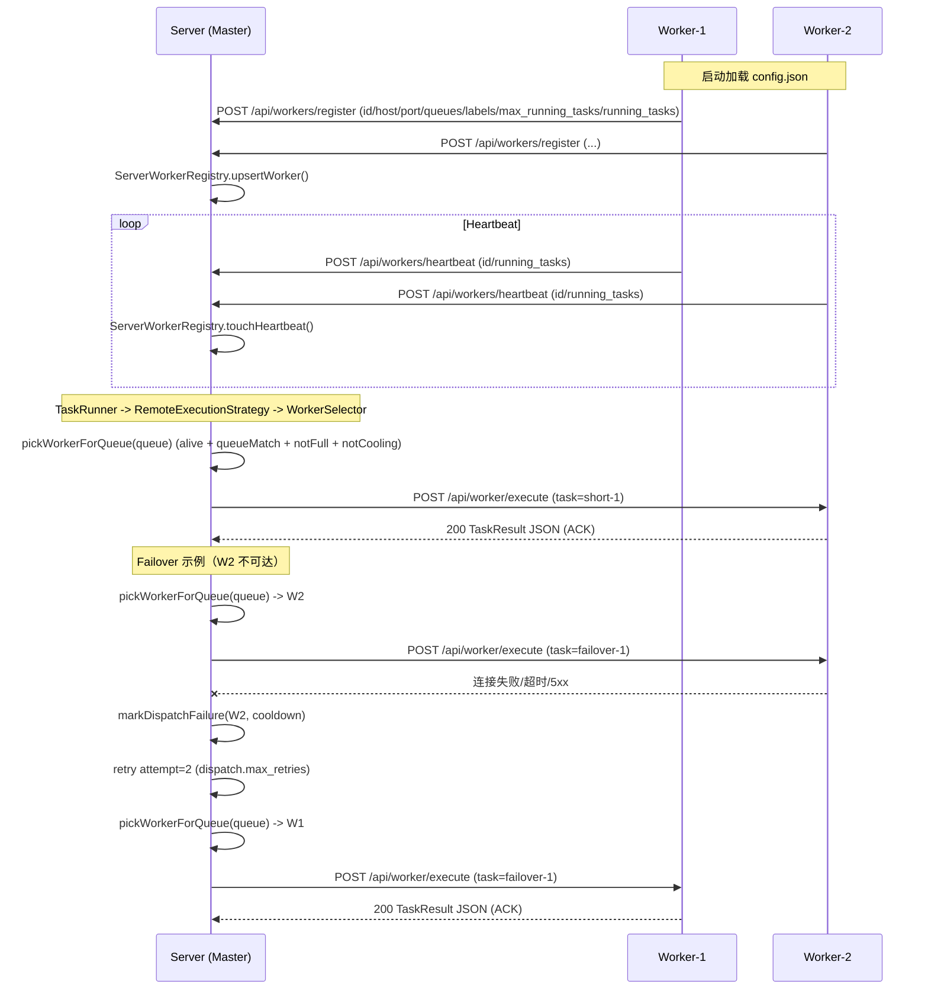

# TaskHub

TaskHub 是一个 C++17 的任务编排系统，包含 Server（DAG/调度/分布式 Worker）与 Qt6 桌面客户端。Server 支持 DAG 执行、Cron 调度、模板渲染、任务日志 WebSocket、分布式 Worker 负载调度与派发重试。

## 亮点
- 单一二进制同时支持 Master/Worker 模式（通过 `work.is_work` 切换）
- DAG 运行与多执行策略（Local/Remote/Shell/HTTP/Script）
- Cron 任务调度、模板渲染 + 执行
- Worker 注册/心跳/负载感知/调度策略 + 派发重试
- WebSocket 任务日志/事件实时推送

## 分布式 Worker 执行流程（1 个 Server + 2 个 Worker）



## 目录结构
- `server/` C++ Server（HTTP + WS、DAG、Cron、Worker Registry、DB）
- `client/` Qt6 桌面客户端
- `third_party/` httplib 与 nlohmann_json 头文件
- `API.md` HTTP 与 WebSocket API 文档
- `server/config/default_config.json` 默认配置
- `server/migrations/` SQLite migrations
- `m11_7_dispatch_retry_check.sh` 派发重试验收脚本

## 构建

Server + Client：
```bash
cmake -S . -B build
cmake --build build
```

仅 Server：
```bash
cmake -S . -B build -DBUILD_TASKHUB_CLIENT=OFF
cmake --build build
```

仅 Client：
```bash
cmake -S . -B build -DBUILD_TASKHUB_SERVER=OFF
cmake --build build
```

## 运行

### Master
```bash
./build/bin/taskhub_server
```

配置加载顺序（先找到先用）：
1. `/etc/taskhub/config.json`
2. `./config.json`（当前工作目录）
3. `./build/bin/config.json`
4. `./server/config/default_config.json`

### Worker
使用同一个二进制，配置文件中设 `work.is_work=true` 并指向 master。

最小示例（每个 worker 拷贝一份再改端口/ID）：
```json
{
  "server": { "host": "127.0.0.1", "port": 8083 },
  "work": {
    "is_work": true,
    "master_host": "127.0.0.1",
    "master_port": 8082,
    "worker_host": "127.0.0.1",
    "worker_port": 8083,
    "heartbeat_interval_ms": 5000,
    "max_running_tasks": 1,
    "worker_id": "worker-1",
    "queues": ["default"],
    "labels": ["shell"]
  },
  "worker": { "select_strategy": "least-load" },
  "dispatch": { "max_retries": 2 },
  "database": { "db_path": "./taskhub_worker1.db", "migrations_dir": "./migrations" },
  "log": { "path": "./worker1.log" }
}
```

在包含 `config.json` 的目录下运行：
```bash
./build/bin/taskhub_server
```

## 关键配置项
- `work.is_work`：是否以 Worker 模式运行
- `work.master_host` / `work.master_port`
- `work.worker_host` / `work.worker_port`
- `work.heartbeat_interval_ms`
- `work.max_running_tasks`：Worker 最大并发容量
- `work.queues` / `work.labels`
- `worker.select_strategy`：`least-load`（默认）或 `rr`
- `dispatch.max_retries`：派发重试次数（默认 2）
- `database.db_path` / `database.migrations_dir`
- `log.path`

## 分布式扩展说明
- `/api/worker/execute` 支持 `type=task|dag|template`，`dag/template` 为异步派发并返回 `run_id`
- Master -> Worker 的远程派发可通过 `exec_params` 扩展：
  - `remote.payload_type`: `task|dag|template`
  - `remote.payload_json`: JSON 字符串（对应 payload）
- 本地同步 DAG / Template 任务：
  - `exec_type: Dag`，`exec_params.dag_json` = DAG JSON 字符串
  - `exec_type: Template`，`exec_params.template_id` + `exec_params.template_params_json`
  - 会生成新的 `run_id` 并落库（`dag_run`/`task_run`），payload 内部 `run_id` 会被覆盖
- 日志透传：`GET /api/workers/proxy/logs?worker_id=...&task_id=...`
- DAG/事件透传：`/api/workers/proxy/dag/task_runs`、`/api/workers/proxy/dag/events`
- WS 透传：在 Master WS 连接上发送 `{"op":"proxy","worker_id":"..."}`，后续消息直达 Worker WS

## API
详见 `API.md`。

## 脚本
- `m11_7_dispatch_retry_check.sh`：启动 1 Master + 2 Worker，验证负载调度与 failover 重试。
- 其他本地脚本：`m11_3.sh`、`m11_4.sh`、`m13.sh` 等。

## 备注
- WebSocket 监听端口：`8090`
- SQLite migrations 会在 CMake 构建时复制到 `build/bin/migrations`
