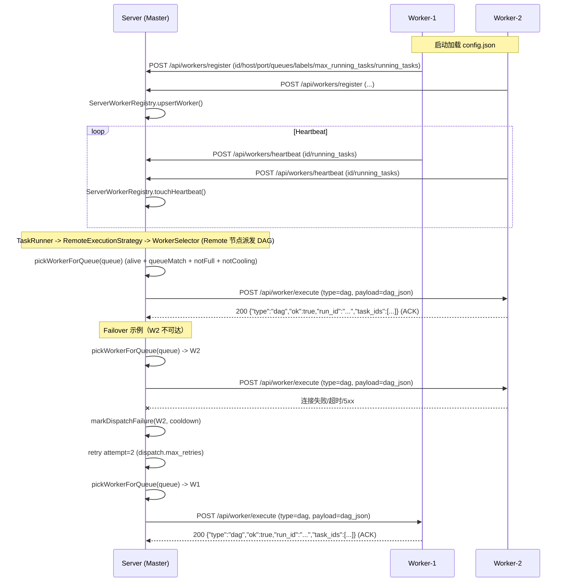

# TaskHub

TaskHub 是一个 C++17 的任务编排系统，包含 Server（DAG/调度/分布式 Worker）与 Qt6 桌面客户端。Server 支持 DAG 执行、Cron 调度、模板渲染、任务日志 WebSocket、分布式 Worker 负载调度与派发重试。

## 亮点
- 单一二进制同时支持 Master/Worker 模式（通过 `work.is_work` 切换）
- DAG 运行与多执行策略（Local/Remote/Shell/HTTP/Script）
- Cron 任务调度、模板渲染 + 执行
- Worker 注册/心跳/负载感知/调度策略 + 派发重试
- WebSocket 任务日志/事件实时推送

## 分布式 Worker 执行流程（1 个 Server + 2 个 Worker）



## 目录结构
- `server/` C++ Server（HTTP + WS、DAG、Cron、Worker Registry、DB）
- `client/` Qt6 桌面客户端
- `third_party/` httplib 与 nlohmann_json 头文件
- `API.md` HTTP 与 WebSocket API 文档
- `server/config/default_config.json` 默认配置
- `server/migrations/` SQLite migrations
- `m11_7_dispatch_retry_check.sh` 派发重试验收脚本

## 构建

Server + Client：
```bash
cmake -S . -B build
cmake --build build
```

仅 Server：
```bash
cmake -S . -B build -DBUILD_TASKHUB_CLIENT=OFF
cmake --build build
```

仅 Client：
```bash
cmake -S . -B build -DBUILD_TASKHUB_SERVER=OFF
cmake --build build
```

## 运行

### Master
```bash
./build/bin/taskhub_server
```

配置加载顺序（先找到先用）：
1. `/etc/taskhub/config.json`
2. `./config.json`（当前工作目录）
3. `./build/bin/config.json`
4. `./server/config/default_config.json`

### Worker
使用同一个二进制，配置文件中设 `work.is_work=true` 并指向 master。

最小示例（每个 worker 拷贝一份再改端口/ID）：
```json
{
  "server": { "host": "127.0.0.1", "port": 8083 },
  "work": {
    "is_work": true,
    "master_host": "127.0.0.1",
    "master_port": 8082,
    "worker_host": "127.0.0.1",
    "worker_port": 8083,
    "heartbeat_interval_ms": 5000,
    "max_running_tasks": 1,
    "worker_id": "worker-1",
    "queues": ["default"],
    "labels": ["shell"]
  },
  "worker": { "select_strategy": "least-load" },
  "dispatch": { "max_retries": 2 },
  "database": { "db_path": "./taskhub_worker1.db", "migrations_dir": "./migrations" },
  "log": { "path": "./worker1.log" }
}
```

在包含 `config.json` 的目录下运行：
```bash
./build/bin/taskhub_server
```

## 关键配置项
- `work.is_work`：是否以 Worker 模式运行
- `work.master_host` / `work.master_port`
- `work.worker_host` / `work.worker_port`
- `work.heartbeat_interval_ms`
- `work.max_running_tasks`：Worker 最大并发容量
- `work.queues` / `work.labels`
- `worker.select_strategy`：`least-load`（默认）或 `rr`
- `dispatch.max_retries`：派发重试次数（默认 2）
- `database.db_path` / `database.migrations_dir`
- `log.path`

## 分布式扩展说明
- Remote 节点（`exec_type: Remote`）当前用于“派发子 DAG”：必须提供 `exec_params.dag_json`（DAG JSON 字符串），Master 会转成 `{"type":"dag","payload":...}` 调用 Worker 的 `/api/worker/execute`，并返回 `run_id/task_ids` ACK
- 本地同步 DAG / Template 任务：
  - `exec_type: Dag`，`exec_params.dag_json` = DAG JSON 字符串
  - `exec_type: Template`，`exec_params.template_id` + `exec_params.template_params_json`
- 透传查询（支持多级 Remote 嵌套，按 `remote_path` 逐跳定位）：
  - 日志：`GET /api/workers/proxy/logs?run_id=...&remote_path=R_1/R_2&task_id=...`
  - DAG/事件：`/api/workers/proxy/dag/task_runs`、`/api/workers/proxy/dag/events`（同样支持 `remote_path`）
- WS 透传：在 Master WS 连接上发送 `{"op":"proxy","worker_id":"..."}`，后续消息直达 Worker WS

## API
详见 `API.md`。

## 脚本
- `m7.sh`：M7 超时/重试/取消回归（需要 `jq`）。用法：`./m7.sh`
- `m7_min.sh`：轮询单个任务状态。用法：`./m7_min.sh <task_id>`
- `m8.sh`：DAG 回归（`/api/dag/run`，需要登录）。用法：`BASE_URL=http://localhost:8082 ./m8.sh`
- `dag_abcd_test.sh`：DAG ABCD/SkipDownstream + 日志校验（需要 `python3`，需要登录）。用法：`BASE=http://localhost:8082 ./dag_abcd_test.sh`
- `m10.sh`：Cron 单任务/ DAG 创建 + 列表（需要登录）。用法：`ENDPOINT=http://localhost:8082 ./m10.sh`
- `m11_3.sh`：Worker 注册/心跳 + Remote 派发测试（需要登录）。用法：`SERVER=http://localhost:8082 WORKER_PORT=8083 ./m11_3.sh`
- `m11_4.sh`：Worker TTL/prune 行为测试。用法：`./m11_4.sh`
- `m11_7_dispatch_retry_check.sh`：启动 1 Master + 2 Worker，验证负载调度与 failover 重试。用法：`TASKHUB_SERVER_BIN=... TASKHUB_FORCE_KILL_PORTS=1 ./m11_7_dispatch_retry_check.sh`
- `m13.sh`：模板创建/渲染/执行回归（需要登录）。用法：`BASE=http://localhost:8082 ./m13.sh`
- `m14_dag_template_worker_check.sh`：Dag/Template exec_type + worker_execute DAG 端到端测试。用法：`TASKHUB_SERVER_BIN=... ./m14_dag_template_worker_check.sh`
- `docker_up.sh`：容器内编译并启动 1 Master + 2 Worker 容器。用法：`./docker_up.sh`
- `seed_templates.sh`：通过 `/template` 批量创建示例模板（默认覆盖 8082/8083/8084）。用法：`BASES="http://localhost:8082 http://localhost:8083 http://localhost:8084" ./seed_templates.sh`

## Docker 运行（容器内编译）
使用 `debian:bookworm-slim` 多阶段构建，在构建阶段完成编译，运行镜像只包含编译产物。

一键编译并启动：
```bash
./docker_up.sh
```
可选环境变量：
- `TASKHUB_SKIP_BUILD=1`：跳过 build，只执行 `up -d`
- `APT_RETRIES=5`：构建阶段 apt 重试次数（默认 3）
- `BUILD_JOBS=1`：容器内编译并行度（默认 1，内存不足时保持 1）
- `TZ=Asia/Shanghai`：容器时区（默认 `Asia/Shanghai`）

启动 1 个 Master + 2 个 Worker：
```bash
docker compose up --build
```

端口映射：
- Master：HTTP `8082`，WS `8090`
- Worker1：HTTP `8083`，WS `8091`（容器内仍是 `8090`）
- Worker2：HTTP `8084`，WS `8092`（容器内仍是 `8090`）

配置文件：
- `docker/config/master.json`
- `docker/config/worker1.json`
- `docker/config/worker2.json`

数据与日志：
- `docker/data/master`
- `docker/data/worker1`
- `docker/data/worker2`

## 备注
- WebSocket 监听端口：`8090`
- SQLite migrations 会在构建阶段复制到构建产物并打包进镜像
