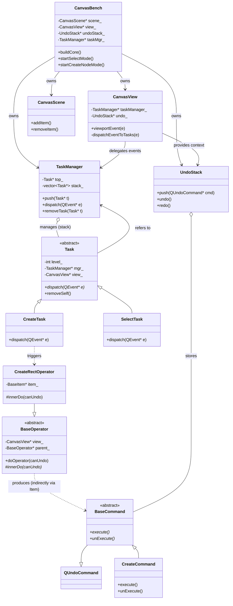

# STOC Architecture Core Class Diagram

STOC (Scene, Task, Operator, Command) is a specialized architectural pattern used in the TaskHub client to manage complex canvas interactions, undo/redo capabilities, and event routing.

## Class Diagram

## Component Descriptions

### 1. Scene (S) - `CanvasScene`
Inherits from `QGraphicsScene`. It manages the visual objects (Nodes, Lines) and their spatial relationships. It is the data container for the graphics.

### 2. Task (T) - `Task` & `TaskManager`
The interaction layer.
- **Task**: Represents a UI state or tool (e.g., Selecting, Connecting, Creating). Tasks handle input events (mouse, keyboard).
- **TaskManager**: Manages a stack of Tasks. Events are dispatched from the top of the stack downwards. Higher-level tasks can intercept and stop event propagation.

### 3. Operator (O) - `BaseOperator`
The business logic layer.
- Operators encapsulate "what to do" without worrying about "how to undo".
- They often act as factories or orchestrators that eventually produce **Commands**.
- In STOC, Operators are used to decouple the Task (UI logic) from the Command (data mutation logic).

### 4. Command (C) - `BaseCommand`
The data mutation layer.
- Inherits from `QUndoCommand`.
- Implements `execute()` (redo) and `unExecute()` (undo).
- Commands are the only objects allowed to modify the Scene's data structure to ensure reliable undo/redo.

## Workflow Example: Creating a Node
1. **View**: User clicks on the canvas. `CanvasView` receives the event.
2. **Task**: `CanvasView` dispatches the event to the `TaskManager`. The `CreateTask` (on top) intercepts the click.
3. **Operator**: `CreateTask` triggers a `CreateRectOperator`.
4. **Command**: The Operator (or the Item it interacts with) creates a `CreateCommand` and pushes it to the `UndoStack`.
5. **Execution**: `UndoStack` calls `redo()` on the Command, which adds the node to the `CanvasScene`.
